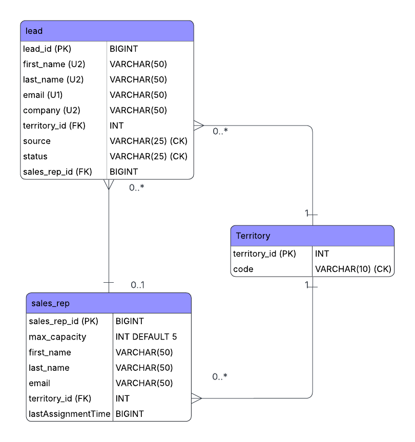

# Ignite Lead Assignment System

A high performance, thread safe Java prototype for ingesting leads from multiple sources 
(Webhooks, CSV, APIs) and distributing them to sales representatives using a 
Capacity Aware Round Robin algorithm.

## Key Features
* **Thread-Safe Architecture:** Uses `ConcurrentHashMap` and `synchronized` blocks to handle high concurrency ingestion.
* **Backpressure Management:** Regional `ConcurrentLinkedQueue` handles lead overflow when sales reps reach their 5 lead capacity.
* **Intelligent Deduplication:** Normalizes identity keys and handles "Territory Changes" by reassigning existing leads to the correct regional rep.
* **Automated Cleanup:** SalesRep offboarding automatically recycles active leads back into the assignment pool.

## How to Run
1. Ensure you have JDK 17+ installed.
2. Run `noa.ignite.assignment.Main` to start the live prototype simulation.

## System Architecture

## Database Schema (ERD)

